# Árbol BST Empresarial en C++

## Integrante
- Lisbeth

---

## Objetivo
Implementar un Árbol Binario de Búsqueda (BST) en C++ para organizar empleados de una empresa utilizando su código como clave principal.

---

## Funcionalidades
- Insertar empleados
- Buscar empleados por código
- Mostrar raíz del árbol
- Recorridos:
  - Inorden
  - Preorden
  - Postorden
- Calcular la altura del árbol
- Mostrar nodos hoja
- Contar empleados
- Cargar datos de prueba automáticamente

---

## Explicación del árbol

El Árbol Binario de Búsqueda (BST) es una estructura de datos jerárquica donde cada nodo contiene un empleado y está organizado según su código.

Cada nodo del árbol tiene:
- Un dato (empleado: código, nombre y cargo)
- Un hijo izquierdo
- Un hijo derecho

### Funcionamiento del BST

El árbol sigue una regla fundamental:

- Si el código del nuevo empleado es menor que el nodo actual → se inserta a la izquierda  
- Si el código es mayor → se inserta a la derecha  

Esto permite que el árbol mantenga un orden que facilita las búsquedas.

---

### Conceptos importantes

- **Raíz:** es el primer nodo del árbol (ejemplo: código 50).  
- **Nodo interno:** nodo que tiene al menos un hijo (ejemplo: 30, 70).  
- **Nodo hoja:** nodo que no tiene hijos (ejemplo: 20, 40, 60, 80).  
- **Altura:** número de niveles del árbol desde la raíz hasta la hoja más lejana.

---

### Operaciones implementadas

- **Inserción:** se realiza de forma recursiva respetando la estructura del BST.  
- **Búsqueda:** compara el código buscado con los nodos para encontrarlo rápidamente.  
- **Recorridos:**
  - Inorden: izquierda → raíz → derecha (muestra los datos ordenados)
  - Preorden: raíz → izquierda → derecha
  - Postorden: izquierda → derecha → raíz  
- **Altura:** se calcula tomando el máximo entre los subárboles izquierdo y derecho.  
- **Hojas:** se identifican los nodos que no tienen hijos.

---

### Ventajas del BST

- Permite búsquedas más rápidas que listas simples  
- Organiza la información de forma jerárquica  
- Facilita operaciones como inserción, recorrido y clasificación  

---

## Capturas del programa

### Menú principal
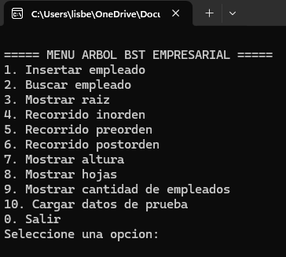

### Insertar empleado
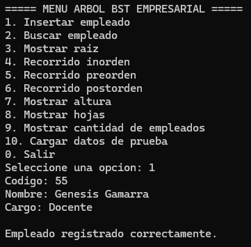

### Buscar empleado
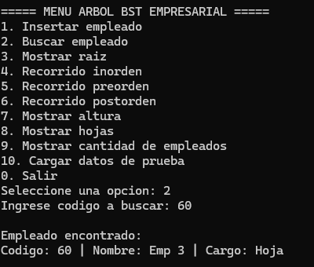

### Datos de prueba
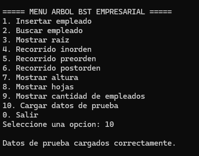

### Raíz
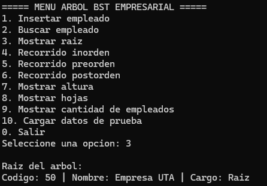

### Recorrido Inorden
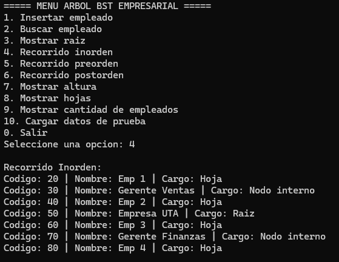

### Recorrido Preorden
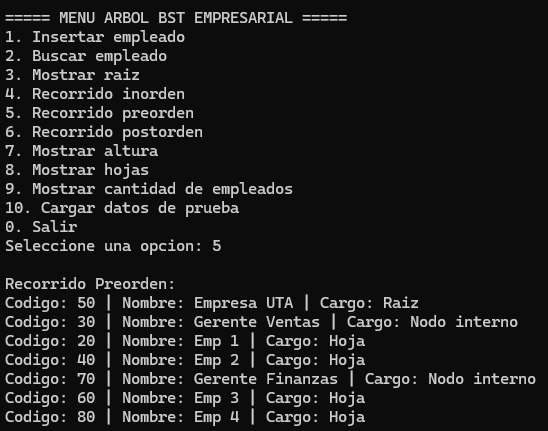

### Recorrido Postorden
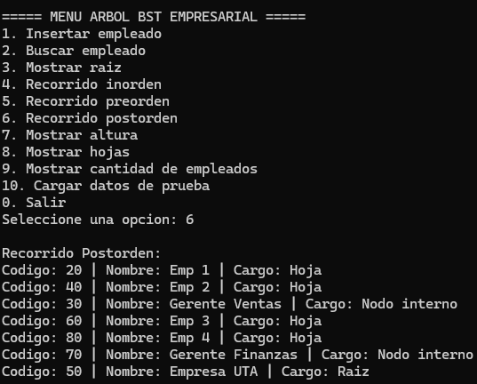

### Altura del árbol
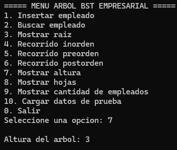

### Nodos hoja
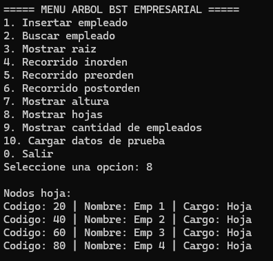

### Cantidad de empleados
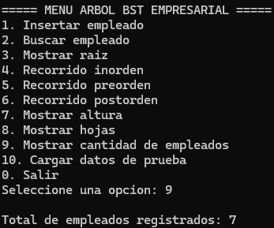

---

## Conclusión

El uso de árboles BST permite organizar datos de forma eficiente, facilitando la búsqueda y gestión de información. Este proyecto demuestra la aplicación práctica de estructuras de datos en un contexto empresarial.
